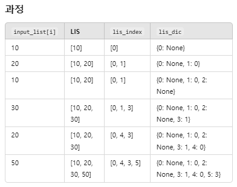

# [Gold IV] 가장 긴 증가하는 부분 수열 4 - 14002 '⭐⭐⭐⭐⭐'❣️'

[문제 링크](https://www.acmicpc.net/problem/14002)

### 성능 요약

메모리: 34476 KB, 시간: 40 ms

### 분류

다이나믹 프로그래밍

### 제출 일자

2025년 3월 25일 00:01:35

### 문제 설명

수열 A가 주어졌을 때, 가장 긴 증가하는 부분 수열을 구하는 프로그램을 작성하시오.

예를 들어, 수열 A = {10, 20, 10, 30, 20, 50} 인 경우에 가장 긴 증가하는 부분 수열은 A = {<strong>10</strong>, <strong>20</strong>, 10, <strong>30</strong>, 20, <strong>50</strong>} 이고, 길이는 4이다.

### 입력

 
첫째 줄에 수열 A의 크기 N (1 ≤ N ≤ 1,000)이 주어진다.

둘째 줄에는 수열 A를 이루고 있는 Ai가 주어진다. (1 ≤ Ai ≤ 1,000)

### 출력

 
첫째 줄에 수열 A의 가장 긴 증가하는 부분 수열의 길이를 출력한다.

둘째 줄에는 가장 긴 증가하는 부분 수열을 출력한다. 그러한 수열이 여러가지인 경우 아무거나 출력한다.

### 메모

실제 수열을 계산하는 문제. 솔직히 설명 들은 게 있어서 바로 풀 줄 알았는데, 이전 원소 저장을 잘못 생각해서 값으로 가져오고, 마지막에 접근하기 위한 리스트 관련해서 잘 생각하지 못했음.

`lis_dic[i]`: 인덱스 i에 해당하는 원소를 key로, LIS 안에서 이전 원소의 인덱스를 value로 저장
`lis_index`: 현재 LIS에서 가장 마지막에 추가된 원소의 인덱스를 가져오기 위해서 활용

💡 핵심 개념:
`lis_index[idx - 1]`을 `lis_dic[i]`에 저장함으로써 이전 LIS 원소의 인덱스를 기록
이를 통해 나중에 역추적할 수 있도록 연결 리스트 형태의 경로를 저장

⬅️ 역추적
lis_index[-1]: 가장 긴 LIS의 마지막 원소 인덱스를 가져옴.
그 뒤에는 lis_dic[last]를 따라가면서 이전 원소의 인덱스를 찾아가며 LIS를 복원
while last is not None: 더 이상 이전 원소가 없을 때까지 반복

마지막에는 다시 [::-1]로 뒤집어줘야 함.

#### 정리

1. LIS의 인덱스 정보를 따로 저장하여 실제 수열을 복원할 수 있도록 함.
2. 역추적 방식으로 LIS의 마지막 원소부터 거슬러 올라감.
3. 뒤집어서 출력하여 올바른 LIS 순서로 복원.
4. 시간 복잡도는 O(N log N)으로 최적화.
   🚀 이 방식 덕분에 LIS를 빠르게 찾으면서도 실제 증가하는 수열을 복원할 수 있다!
